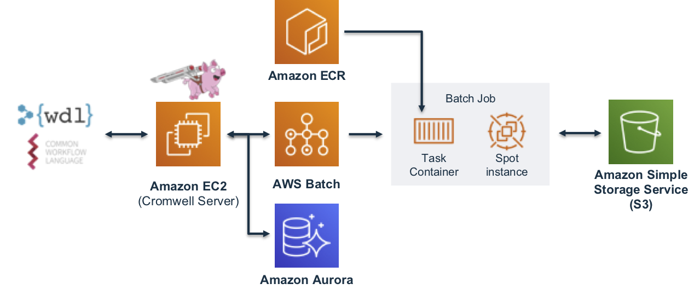

# s4-valinor-cloudformation-template

Cromwell is a workflow management system for scientific workflows developed by the Broad Institute and supports job execution using AWS Batch.

Valinor is a Cromwell with Sema4 flavor:

1. Sema4 Configured VPC
2. include auroa/mysql serveerless database stack, use auroa/mysql as cromwell default database
3. option to create ondemand cromwell server that submit job to ondemand queue or spot cromwell server that submit jobs to spot queue or both.
4. have the permission to do cross account copy.

### Requirements
    
* Get GlobalCIDR, PubNet1, PubNet2, PrivNet1, PrivNet2 values from IT
* Create a EC2 Key
* Create DB Name in system parameter store.

       aws ssm put-parameter --name ValinorDBName --type String --value valinordbname --region us-east-1 --profile profilename
     
* Create DB Username, DB password in secretmanager
    
       aws secretsmanager create-secret --name ValinorAppSecret --secret-string file:///fille_root/valinor_creds.json --profile profilename --region us-east-1
   
   valinor_creds.json:
   
      {
        "CromwellDBUser" : "cromwell_db_user_value",
        "CromwellDBPassword": "cromwell_db_password_value"
      }
* To create Spot Cromwell Server only, leave OndemandInstanceName value empty.

  To create Ondemand Cromwell Server only, leave SpotInstanceName value empty.
  
* If the system only access s3 bucket within the account, leave CrossAccountRole value empty.              
     
### Setup:
`sema4-valinor.yaml` is the master yaml.  To create a full-blown cromwell enabled valinor stack, choose `sema4-valinor.yaml`.

`sema4-bastion.yaml` is the master yaml to create a full-blown pure batch support stack with `/scratch` as mounted scratch space.

  One of way to install valinor is to checkout this, upload them to s3 bucket, and create a config.json file with the value of TemplatePath set to that s3 bucket. Then using awscli:
  
     aws cloudformation create-stack --stack-name s4-valinor  --template-body file:///file-root/s4-valinor-cloudformation-template/sema4-valinor.yaml --parameters file:///file-root/s4-valinor-cloudformation-template/config-params.json --profile profilename --region us-east-1 --capabilities CAPABILITY_AUTO_EXPAND CAPABILITY_IAM
     

  
### Release Notes:

##### s4-valinor-cloudformation-template v1.0.0

1. Cromwell version selections [v42](https://github.com/broadinstitute/cromwell/releases/tag/42), [v46](https://github.com/broadinstitute/cromwell/releases/tag/46), and [latest](https://github.com/broadinstitute/cromwell/releases)
2. [aws-genomics-workflows v2.3.0](https://github.com/aws-samples/aws-genomics-workflows/releases/tag/v2.3.0)